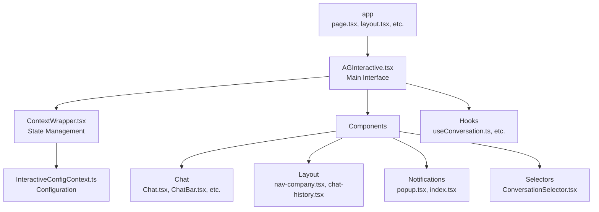

# AGInteractive Architecture Reference

This document provides a comprehensive reference of the AGInteractive architecture, with a focus on components, context, and configuration. Core functionality is described in detail first, followed by component functionality that builds upon the core patterns.

## System Architecture

AGInteractive is a modular, extensible React-based framework built with a layered architecture:



### Naming Conventions
- Component Files: PascalCase.tsx (e.g., "Chat.tsx")
- Context Files: PascalCase + "Context".ts (e.g., "InteractiveConfigContext.ts")
- Hook Files: camelCase.ts (e.g., "useConversation.ts")
- Configuration Files: PascalCase + "Config" (e.g., "InteractiveConfigDefault.js")
- Layout Files: kebab-case.tsx (e.g., "nav-company.tsx")

### Core Design Principles

1. **Context-Based Configuration**: Global state managed through React Context API
2. **Component-Based Architecture**: Functionality encapsulated in reusable components
3. **Environment-Based Configuration**: Settings can be provided through environment variables
4. **Prop-Based Overrides**: Component behavior can be customized through props
5. **Stateful/Stateless Mode**: Can be used with internal or external state management
6. **Responsive Design**: Adapts to different screen sizes and device types

## Core Functionality

### Configuration Context (InteractiveConfigContext.ts)

The InteractiveConfigContext provides global configuration for the AGInteractive components:

```typescript
export type ChainConfig = {
  chainArgs: object;
  singleStep: boolean;
  fromStep: number;
  allResponses: boolean;
};

export type Overrides = {
  mode?: 'prompt' | 'chain' | 'command';
  prompt?: string;
  promptCategory?: string;
  command?: string;
  commandArgs?: object;
  commandMessageArg?: string;
  chain?: string;
  chainRunConfig?: ChainConfig;
  contextResults?: number;
  shots?: number;
  websearchDepth?: number;
  injectMemoriesFromCollectionNumber?: number;
  conversationResults?: number;
  conversation?: string;
  conversationID?: string;
  browseLinks?: boolean;
  webSearch?: boolean;
  insightAgentName?: string;
  enableMemory?: boolean;
};

export type InteractiveConfig = {
  agent: string;
  sdk: AGInterfaceSDK;
  openai?: OpenAI;
  overrides?: Overrides;
  mutate?: (InteractiveConfig) => void | ((previous: InteractiveConfig) => InteractiveConfig);
};
```

### Context Wrapper (ContextWrapper.tsx)

The ContextWrapper provides state management for the AGInteractive component:

1. **SDK Initialization**: Creates instances of the AGInterfaceSDK and OpenAI clients
2. **State Management**: Manages the InteractiveConfig state
3. **Context Provider**: Provides the configuration context to child components

```typescript
export default function InteractiveConfigContextWrapper({
  initialState = InteractiveConfigDefault,
  apiKey = getCookie('jwt') || '',
  backEndURI: backEndURI = process.env.NEXT_PUBLIC_API_URI,
  children,
}: {
  requireKey?: boolean;
  apiKey?: string;
  backEndURI?: string;
  initialState?: InteractiveConfig;
  children: ReactNode;
}): React.JSX.Element {
  // Initialize SDK and OpenAI clients
  const sdk: AGInterfaceSDK = new AGInterfaceSDK({
    baseUri: backEndURI,
    apiKey: apiKey,
  });
  const openai: OpenAI = new OpenAI({
    apiKey: apiKey.replace('Bearer ', ''),
    baseURL: backEndURI + '/v1',
    dangerouslyAllowBrowser: true,
  });
  
  // Initialize state
  const [InteractiveConfigState, setInteractiveConfigState] = useState<InteractiveConfig>({
    ...InteractiveConfigDefault,
    ...initialState,
    sdk: sdk,
    openai: openai,
    mutate: null,
  } as InteractiveConfig);

  // Provide context to children
  return (
    <InteractiveConfigContext.Provider
      value={{ ...InteractiveConfigState, sdk, openai: openai, mutate: setInteractiveConfigState }}
    >
      {children}
    </InteractiveConfigContext.Provider>
  );
}
```

### Default Configuration (InteractiveConfigDefault.js)

The InteractiveConfigDefault provides default values for the InteractiveConfig:

```javascript
const InteractiveConfigDefault = {
  agent: process.env.NEXT_PUBLIC_AGINTERACTIVE_AGENT || 'XT',
  sdk: null,
  openai: null,
  overrides: {
    mode: 'prompt',
    prompt: 'Think About It',
    promptCategory: 'Default',
    command: '',
    commandArgs: {},
    commandMessageArg: 'message',
    chain: '',
    chainRunConfig: {
      chainArgs: {},
      singleStep: false,
      fromStep: 0,
      allResponses: false,
    },
    contextResults: 0,
    shots: 0,
    websearchDepth: 0,
    injectMemoriesFromCollectionNumber: 0,
    conversationResults: 5,
    conversation: '-',
    conversationID: '',
    browseLinks: false,
    webSearch: false,
    insightAgentName: '',
    enableMemory: false,
  },
  mutate: null,
};
```

### Main Interface (AGInteractive.tsx)

The AGInteractive component is the main entry point for the interactive interface:

#### Props

```typescript
export type FormProps = {
  fieldOverrides?: { [key: string]: ReactNode };
  formContext?: object;
  additionalFields?: { [key: string]: ReactNode };
  additionalOutputButtons: { [key: string]: ReactNode };
  onSubmit?: (data: object) => void;
};

export type UIProps = {
  showAppBar?: boolean;
  showSelectorsCSV?: string;
  showChatThemeToggles?: boolean;
  enableFileUpload?: boolean;
  enableVoiceInput?: boolean;
  alternateBackground?: 'primary' | 'secondary';
  footerMessage?: string;
  showOverrideSwitchesCSV?: string;
};

export type ServerProps = {
  apiKey: string;
  backEndURI: string;
};

export type AGInteractiveProps = {
  agent?: string;
  overrides?: Overrides;
  uiConfig?: UIProps;
  serverConfig?: ServerProps;
  formConfig?: FormProps;
};
```

#### Stateful Mode

The AGInteractive component can be used in stateful mode, where it provides its own state management:

```typescript
const AGInteractive = ({
  stateful = true,
  agent,
  overrides = {
    mode: (process.env.NEXT_PUBLIC_AGINTERACTIVE_MODE &&
    ['chain', 'prompt'].includes(process.env.NEXT_PUBLIC_AGINTERACTIVE_MODE)
      ? process.env.NEXT_PUBLIC_AGINTERACTIVE_MODE
      : 'prompt') as 'chain' | 'prompt',
  },
  serverConfig = null,
  uiConfig = {},
}: AGInteractiveProps & { stateful?: boolean; agent?: string }): React.JSX.Element => {
  // Initialize UI config with environment variables
  const uiConfigWithEnv = useMemo(
    () => ({
      showAppBar: process.env.NEXT_PUBLIC_AGINTERACTIVE_SHOW_APP_BAR === 'true',
      showRLHF: process.env.NEXT_PUBLIC_AGINTERACTIVE_RLHF === 'true',
      showChatThemeToggles: process.env.NEXT_PUBLIC_AGINTERACTIVE_SHOW_CHAT_THEME_TOGGLES === 'true',
      footerMessage: process.env.NEXT_PUBLIC_AGINTERACTIVE_FOOTER_MESSAGE || '',
      showOverrideSwitchesCSV: process.env.NEXT_PUBLIC_AGINTERACTIVE_SHOW_OVERRIDE_SWITCHES || '',
      alternateBackground: 'primary' as 'primary' | 'secondary',
      showSelectorsCSV: process.env.NEXT_PUBLIC_AGINTERACTIVE_SHOW_SELECTION,
      enableVoiceInput: process.env.NEXT_PUBLIC_AGINTERACTIVE_VOICE_INPUT_ENABLED === 'true',
      enableFileUpload: process.env.NEXT_PUBLIC_AGINTERACTIVE_FILE_UPLOAD_ENABLED === 'true',
      enableMessageDeletion: process.env.NEXT_PUBLIC_AGINTERACTIVE_ALLOW_MESSAGE_DELETION === 'true',
      enableMessageEditing: process.env.NEXT_PUBLIC_AGINTERACTIVE_ALLOW_MESSAGE_EDITING === 'true',
      ...uiConfig,
    }),
    [uiConfig],
  );

  // Render in stateful or stateless mode
  return stateful ? (
    <Stateful overrides={overrides} serverConfig={serverConfig} uiConfig={uiConfigWithEnv} agent={agent} />
  ) : (
    <Interactive {...uiConfigWithEnv} {...overrides} />
  );
};
```

#### Search Param Configuration

The AGInteractive component can be configured using URL search parameters:

```typescript
const generateSearchParamConfig = (searchParams: URLSearchParams): InteractiveConfig =>
  removeUndefined({
    agent: searchParams.get('agent') || undefined,
    sdk: undefined,
    openai: undefined,
    overrides: {
      mode: (searchParams.get('mode') as 'prompt' | 'chain' | 'command') || undefined,
      prompt: searchParams.get('prompt') || undefined,
      promptCategory: searchParams.get('promptCategory') || undefined,
      command: searchParams.get('command') || undefined,
      commandArgs: JSON.parse(searchParams.get('commandArgs')) || undefined,
      commandMessageArg: searchParams.get('commandMessageArg') || undefined,
      chain: searchParams.get('chain') || undefined,
      chainRunConfig: {
        chainArgs: JSON.parse(searchParams.get('chainArgs')) || undefined,
        singleStep: Boolean(searchParams.get('singleStep')) || undefined,
        fromStep: Number(searchParams.get('fromStep')) || undefined,
        allResponses: Boolean(searchParams.get('allResponses')) || undefined,
      },
      contextResults: Number(searchParams.get('contextResults')) || undefined,
      shots: Number(searchParams.get('shots')) || undefined,
      websearchDepth: Number(searchParams.get('websearchDepth')) || undefined,
      injectMemoriesFromCollectionNumber: Number(searchParams.get('injectMemoriesFromCollectionNumber')) || undefined,
      conversationResults: Number(searchParams.get('results')) || undefined,
      conversation: searchParams.get('conversation') || undefined,
      conversationID: searchParams.get('conversationID') || undefined,
      browseLinks: Boolean(searchParams.get('browseLinks')) || undefined,
      webSearch: Boolean(searchParams.get('webSearch')) || undefined,
      insightAgentName: searchParams.get('insightAgent') || undefined,
      enableMemory: Boolean(searchParams.get('memory')) || undefined,
    },
    mutate: undefined,
  }) as InteractiveConfig;
```

## Component Functionality

### Chat Components

#### Chat.tsx
The main chat interface component that orchestrates all chat functionality:
- Message display and management
- User input handling
- Chat mode configuration (prompt, chain, command)
- Theme and display options

#### ChatBar.tsx
The input interface for entering messages:
- Text input
- File upload (optional)
- Voice input (optional)
- Send button
- Customizable through props

#### ChatLog.tsx
Displays the conversation history:
- Message rendering
- Message threading
- Loading states
- Error states

#### Message Components
Handles individual message display:
- User messages
- Assistant messages
- System messages
- Error messages
- Message actions (edit, delete, etc.)

### Layout Components

#### nav-company.tsx
Company navigation component:
- Company logo and branding
- Navigation links
- User profile information

#### chat-history.tsx
Displays conversation history:
- List of past conversations
- Filtering and sorting options
- Conversation actions (view, delete, export)

### Notifications Components

#### popup.tsx
Popup notification component:
- Success notifications
- Error notifications
- Warning notifications
- Info notifications

#### index.tsx
Notification manager component:
- Notification creation
- Notification dismissal
- Notification positioning

### Selectors Components

#### ConversationSelector.tsx
Component for selecting and managing conversations:
- Conversation dropdown
- New conversation button
- Delete conversation button
- Export conversation button

### Navigation

#### NavMenu.tsx
Defines the navigation structure:
- Main navigation items
- Sub-navigation items
- Icons and URLs
- Active state management

```typescript
export const items: Item[] = [
  {
    title: 'New Chat',
    url: '/chat',
    icon: TbMessageCirclePlus,
    isActive: true,
  },
  {
    title: 'Agent Management',
    icon: Bot,
    items: [
      {
        title: 'Prompt Library',
        icon: SquareLibrary,
        url: '/settings/prompts',
      },
      // ...more items
    ],
  },
  // ...more sections
];
```

### Hooks

#### useConversation.ts
Custom hook for conversation management:
- Conversation loading
- Conversation updating
- Conversation creation
- Conversation deletion

#### useMediaQuery
Custom hook for responsive design:
- Detects screen size changes
- Returns boolean based on media query match

```typescript
function useMediaQuery(query: string) {
  const [matches, setMatches] = useState(false);

  useEffect(() => {
    const mediaQuery = window.matchMedia(query);
    setMatches(mediaQuery.matches);

    const handler = (event: MediaQueryListEvent) => {
      setMatches(event.matches);
    };

    mediaQuery.addEventListener('change', handler);
    return () => mediaQuery.removeEventListener('change', handler);
  }, [query]);

  return matches;
}
```

## App Integration

### page.tsx
The main page component that renders the AGInteractive component:
- Page metadata
- Layout configuration
- AGInteractive initialization

### layout.tsx
The main layout component that provides the page structure:
- Header
- Main content area
- Footer
- Global styles

### Error Handling

Error pages and error boundaries handle error states gracefully:
- not-found.tsx: Custom 404 page
- old.error.tsx: Custom error page

## Environment Configuration

Key environment variables:
- NEXT_PUBLIC_AGINTERACTIVE_AGENT: Default agent to use
- NEXT_PUBLIC_AGINTERACTIVE_MODE: Mode to use (prompt, chain, command)
- NEXT_PUBLIC_AGINTERACTIVE_PROMPT_NAME: Default prompt to use
- NEXT_PUBLIC_AGINTERACTIVE_CONVERSATION_MODE: How to manage conversations
- NEXT_PUBLIC_API_URI: Backend API URI
- NEXT_PUBLIC_AGINTERACTIVE_API_KEY: API key for backend
- NEXT_PUBLIC_AGINTERACTIVE_SHOW_APP_BAR: Whether to show the app bar
- NEXT_PUBLIC_AGINTERACTIVE_SHOW_SELECTION: Selectors to show
- NEXT_PUBLIC_AGINTERACTIVE_VOICE_INPUT_ENABLED: Whether to enable voice input
- NEXT_PUBLIC_AGINTERACTIVE_FILE_UPLOAD_ENABLED: Whether to enable file upload
